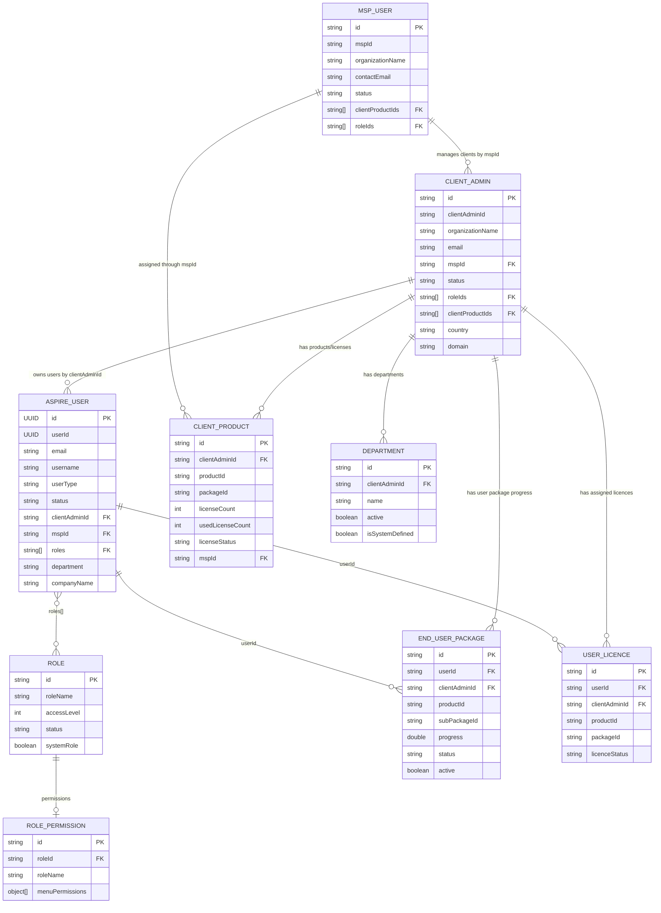
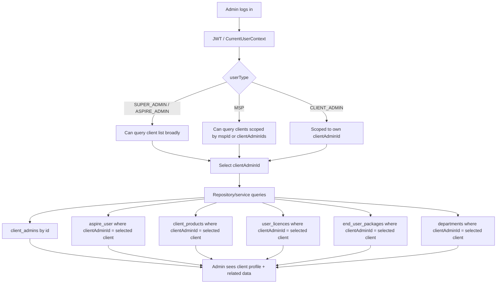

# Admin and Client Entity Diagram

## Entity Relationship



## How Admin Sees Client Data



## Main Join Key

Most client-owned data is grouped by:

```text
clientAdminId
```

For example:

```text
aspire_user.clientAdminId
client_products.clientAdminId
end_user_packages.clientAdminId
user_licences.clientAdminId
departments.clientAdminId
```

That is why admin screens can load a selected client and then fetch all related data using the same `clientAdminId`.
