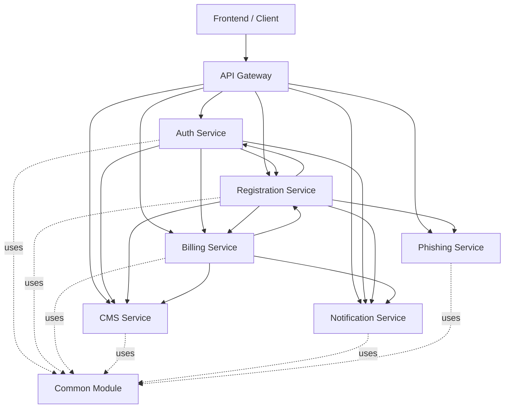
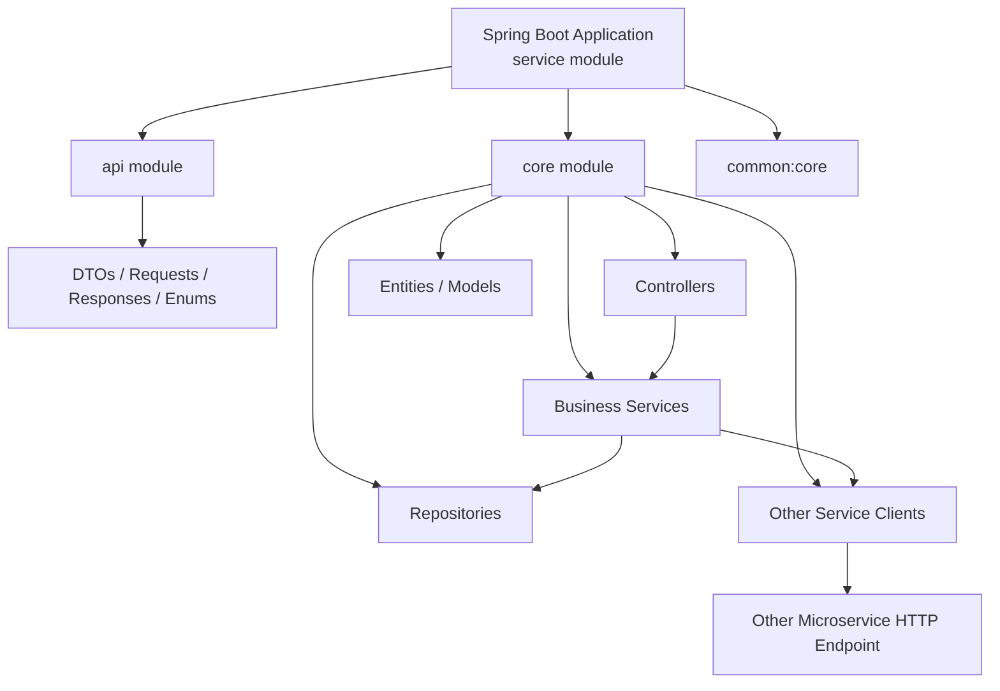
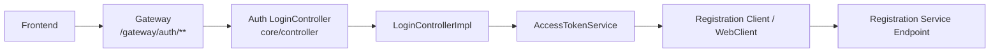

# ASAT Backend Architecture Diagrams

## Service Communication



## Module Structure



## Auth Login Flow



## Module Responsibility

```text
service module
  -> starts the Spring Boot app
  -> contains application.yml files
  -> depends on api + core + common

api module
  -> DTOs
  -> request/response classes
  -> enums/contracts

core module
  -> controllers
  -> controller implementations
  -> services
  -> repositories
  -> clients for calling other services
  -> business logic

common module
  -> shared DTOs
  -> shared exceptions
  -> utilities
  -> file/storage logic
  -> shared enums
  -> shared clients/config
```
