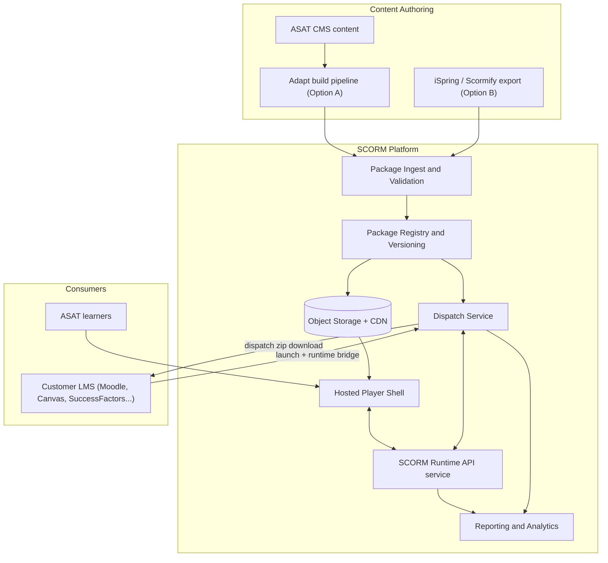
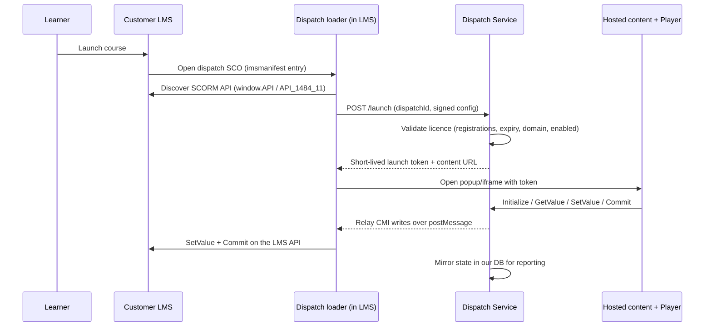
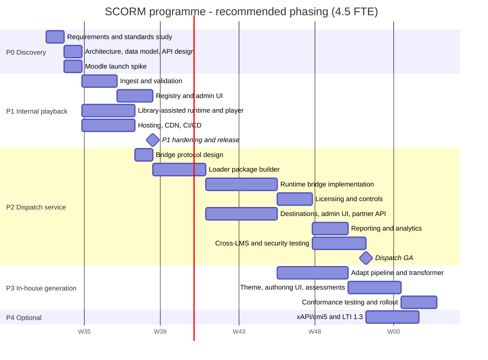

# SCORM Implementation & Dispatch Service - Development Plan and Hour-Level Timeline

Version: 1.0 (draft for review)
Owner: Engineering / Platform
Status: Planning - not yet approved

---

## 1. Purpose of this document

This document defines the work breakdown, effort estimates (in engineering hours) and delivery timeline for three related capabilities:

1. **SCORM package generation** - producing standards-compliant SCORM packages from our content, either
   - **Option A:** in-house generation using an open-source adaptive-learning authoring stack (Adapt Learning Framework), or
   - **Option B:** third-party authoring/conversion tools (Scormify, iSpring Suite, Articulate, etc.) plus an ingest pipeline.
2. **SCORM hosting and runtime (player)** - hosting extracted packages and implementing the SCORM Run-Time Environment so courses can be played and tracked inside our own platform.
3. **SCORM Dispatch service** - a Rustici SCORM Cloud "Dispatch"-equivalent service that lets us distribute a thin proxy package to a customer's LMS while the real content stays on our servers, with licensing controls, kill-switch, and reporting.

All estimates are **engineering hours of focused work**, excluding vacation, hiring, procurement lead time, and customer-side scheduling delays.

---

## 2. Assumptions

| # | Assumption | Impact if wrong |
|---|---|---|
| A1 | Backend is Java 17 + Spring Boot microservices; new services follow the same conventions (Maven multi-module, OpenAPI, existing auth). | Hours shift by 5-10% if a different stack is chosen. |
| A2 | Object storage (S3 or S3-compatible) plus a CDN is available or can be provisioned. | +40h if storage/CDN must be built from scratch. |
| A3 | A relational DB (MySQL/PostgreSQL) is available for registration/tracking state. | +16h for schema/infra work. |
| A4 | Admin/authoring UI is built in the existing frontend framework and design system. | +30-60h if a new admin app must be bootstrapped. |
| A5 | Target standards: **SCORM 1.2 and SCORM 2004 4th Edition**; xAPI/cmi5 and LTI 1.3 are optional stretch goals. | Dropping SCORM 2004 saves ~110h; adding cmi5 as mandatory adds ~40h. |
| A6 | Content is **single-SCO per package** (one launchable unit). Full SCORM 2004 Sequencing & Navigation across multiple SCOs is explicitly out of scope for v1. | Full SN support adds 120-200h and significant risk. |
| A7 | One dedicated instructional designer / content author exists on the business side (not counted in engineering hours). | Content readiness becomes the critical path. |
| A8 | Team availability is **6 productive hours/day, 30h/week per engineer**. | Calendar duration scales linearly. |

---

## 3. Target architecture

### 3.1 How dispatch works at runtime

---

## 4. Work breakdown structure and estimates

Role codes: **ARCH** architect, **BE** backend, **JS** browser/runtime specialist, **FE** frontend/admin UI, **OPS** DevOps, **QA** test engineer, **ID** instructional designer.

### Track 0 - Discovery, standards study and architecture (shared prerequisite)

| ID | Task | Role | Hours |
|---|---|---|---|
| 0.1 | Requirements workshop: which SCORM versions, target customer LMSs, licensing model, reporting needs | ARCH+PM | 8 |
| 0.2 | Standards study: SCORM 1.2 RTE + CAM, SCORM 2004 4th Ed CMI data model, cmi5 overview | ARCH+JS | 12 |
| 0.3 | Solution architecture + ADRs (build vs buy, service boundaries, storage model) | ARCH | 16 |
| 0.4 | Data model design: course, package, package_version, sco, dispatch, destination, registration, cmi_state, activity_log | ARCH+BE | 12 |
| 0.5 | API contract design (OpenAPI) for ingest, registry, launch, runtime, dispatch, reporting | ARCH+BE | 12 |
| 0.6 | Security and multi-tenancy design: launch tokens, HMAC-signed dispatch config, domain allow-list, tenant isolation | ARCH | 8 |
| 0.7 | Spike: launch a known-good SCORM package in a Moodle sandbox and trace the API calls end to end | JS | 12 |
| | **Track 0 subtotal** | | **80** |

---

### Track 1A - Option A: In-house generation with Adapt Learning Framework

Approach: author structured content in our CMS, transform it into Adapt course JSON (`course.json`, `contentObjects.json`, `articles.json`, `blocks.json`, `components.json`), build with the Adapt CLI (`adapt build`) inside a containerised build agent, enable the `adapt-contrib-spoor` plugin for SCORM tracking, then zip and register the output.

| ID | Task | Role | Hours | Depends |
|---|---|---|---|---|
| 1A.1 | Build environment: Node toolchain, `adapt-cli`, framework repo pinning, plugin registry mirror, Docker build image | OPS+BE | 12 | 0.3 |
| 1A.2 | Framework and plugin evaluation: components (text, media, MCQ, matching, slider), `spoor` tracking config, accessibility check | JS+ID | 12 | 0.2 |
| 1A.3 | Schema mapping: CMS topic/lesson/question model to Adapt JSON structures; mapping spec document | ARCH+BE | 24 | 0.4 |
| 1A.4 | Content transformer service: generate valid Adapt JSON from CMS entities, incl. validation against Adapt schemas | BE | 40 | 1A.3 |
| 1A.5 | Asset pipeline: resolve media references, transcode/optimise, rewrite relative paths, stage into build workspace | BE | 20 | 1A.4 |
| 1A.6 | Theme and branding: custom Adapt theme (typography, colours, logo), responsive checks, i18n/RTL if required | FE+JS | 32 | 1A.2 |
| 1A.7 | Build orchestration service: job queue, worker invoking `adapt build`, timeouts, logs, status callbacks, retries | BE | 32 | 1A.1 |
| 1A.8 | Manifest and tracking config: `imsmanifest.xml` generation/validation, SCORM 1.2 vs 2004 switch, completion/scoring rules via spoor | BE+JS | 16 | 1A.7 |
| 1A.9 | Packaging and versioning: deterministic zip, checksum, semantic version records, immutable storage | BE | 16 | 1A.8 |
| 1A.10 | Author preview: serve unzipped build behind signed URL, "preview before publish" flow | BE+FE | 16 | 1A.9 |
| 1A.11 | Authoring/admin UI: trigger build, watch status, view logs, download zip, publish/unpublish | FE | 40 | 1A.7 |
| 1A.12 | Question/assessment mapping: reuse existing question bank inside Adapt assessment components, score rollup to `cmi.score` | BE+JS | 32 | 1A.4 |
| 1A.13 | Automated tests: transformer unit tests, golden-file package tests, build smoke tests | BE+QA | 32 | 1A.9 |
| 1A.14 | Conformance testing against the ADL SCORM test suite + defect fixes | QA+JS | 24 | 1A.13 |
| 1A.15 | Documentation: author guide, build troubleshooting runbook, mapping reference | ARCH+ID | 12 | - |
| | **Track 1A subtotal** | | **360** | |

**Variant 1A-alt:** self-host the full **Adapt Authoring Tool** (Node + MongoDB) instead of building a transformer - approx. **100-140h** (install, hardening, SSO, content migration, upgrade strategy) but it gives authors a WYSIWYG UI while removing the CMS-driven automation. Cannot be combined cheaply with 1A.3/1A.4; treat as an either/or.

**Legal check (must-do, 4h, non-engineering):** the Adapt Framework and its authoring tool are distributed under **GPL-family licensing**. Because generated packages embed framework code and are handed to customers, confirm with legal whether attribution/source-availability obligations apply to dispatched packages before committing to Option A.

---

### Track 1B - Option B: Third-party authoring (Scormify / iSpring Suite) + ingest

Approach: authors produce SCORM packages in a commercial tool; we build only the ingest, validation and registry side. No generation code.

| ID | Task | Role | Hours | Depends |
|---|---|---|---|---|
| 1B.1 | Vendor evaluation: iSpring Suite (PowerPoint-based desktop authoring), Scormify (file-to-SCORM conversion), Articulate 360/Rise, Lectora - trial builds, output inspection, API availability | ARCH+ID | 16 | 0.2 |
| 1B.2 | Authoring workflow definition: templates, naming/versioning conventions, QA checklist, author training material | ID | 16 | 1B.1 |
| 1B.3 | Upload/ingest endpoint: chunked multipart upload, size limits, malware scan, idempotency | BE | 16 | 0.5 |
| 1B.4 | Package validation: safe unzip (zip-slip protection), `imsmanifest.xml` XSD validation, SCORM version detection, entry resource resolution, missing-asset report | BE | 24 | 1B.3 |
| 1B.5 | Metadata extraction and storage: title, SCO list, mastery score, launch parameters, version records | BE | 16 | 1B.4 |
| 1B.6 | Package registry CRUD + admin UI: list, search, versions, replace, archive | BE+FE | 32 | 1B.5 |
| 1B.7 | Preview and publish workflow with approval step | BE+FE | 16 | 1B.6 |
| 1B.8 | Automated tests incl. malformed/adversarial package fixtures | QA+BE | 16 | 1B.6 |
| 1B.9 | Documentation: author export settings per tool, ingest troubleshooting | ID | 8 | - |
| | **Track 1B subtotal** | | **160** | |

**Recurring cost note (verify current vendor pricing before deciding):** commercial authoring suites are typically licensed **per author per year** (roughly US$700-1,000/author/year for iSpring Suite-class tools); SaaS converters like Scormify are usually **monthly per-seat or per-conversion**. Option B is far cheaper to build and far more expensive to run at scale; Option A inverts that.

---

### Track 2 - Hosting and SCORM runtime (player) - required to play content ourselves

| ID | Task | Role | Hours | Depends |
|---|---|---|---|---|
| 2.1 | Content hosting service: extract to object storage, path routing, signed URLs/cookies, correct MIME types, CORS | BE+OPS | 24 | 1B.4 |
| 2.2 | SCORM 1.2 RTE adapter: `LMSInitialize`, `LMSGetValue`, `LMSSetValue`, `LMSCommit`, `LMSFinish`, `LMSGetLastError`, full error-code table | JS | 40 | 0.7 |
| 2.3 | SCORM 2004 4th Ed `API_1484_11` + CMI data model: interactions, objectives, `completion_status`/`success_status`, `suspend_data` (64k), `exit`/`entry` semantics | JS | 48 | 2.2 |
| 2.4 | Minimal sequencing: single-SCO navigation, `adl.nav.request` handling, TOC for multi-SCO without full SN rules | JS+BE | 60 | 2.3 |
| 2.5 | Runtime persistence API: CMI state store, commit batching, optimistic concurrency, offline buffer and replay | BE | 40 | 2.2 |
| 2.6 | Player shell UI: launch window/iframe, progress, resume prompt, exit handling, unload safety | FE+JS | 40 | 2.1 |
| 2.7 | Attempt/registration lifecycle + score handoff into the existing gradebook/assessment module | BE | 32 | 2.5 |
| 2.8 | Learner reporting: progress, completion, score, time-on-task, per-interaction detail, CSV export | BE+FE | 24 | 2.5 |
| 2.9 | Automated tests + ADL LMS-side conformance run and fixes | QA+JS | 32 | 2.4 |
| 2.10 | Documentation and runbook | ARCH | 12 | - |
| | **Track 2 subtotal (custom build)** | | **352** | |

**Track 2-lite (library-assisted, ~140h):** use a proven open-source client shim (e.g. `scorm-again`) for 2.2/2.3 and restrict to single-SCO, dropping 2.4. Revised: 2.1 = 24h, 2.2+2.3 integration = 32h, 2.5 = 40h, 2.6 = 24h, 2.7 = 16h(reduced scope), 2.8 = 16h(reduced), 2.9 = 20h(reduced), 2.10 = 8h → **140h**. Recommended for the first release; the full custom runtime becomes justified only if multi-SCO sequencing is contractually required.

---

### Track 3 - Dispatch service (SCORM Cloud Dispatch equivalent)

This is the largest and highest-risk track. The core idea: a **dispatch** is a small SCORM package handed to a customer LMS that contains no content - only a signed loader that authenticates back to us, opens the real hosted content, and relays run-time data between the content and the customer's LMS API.

#### 3.1 Design

| ID | Task | Role | Hours |
|---|---|---|---|
| 3.1.1 | Domain model: destination (customer), dispatch (package + licence + destination), registration, activity | ARCH | 12 |
| 3.1.2 | Cross-domain bridge protocol design: postMessage envelope, handshake, token exchange, popup vs iframe modes, failure semantics | ARCH+JS | 16 |
| | **Subtotal** | | **28** |

#### 3.2 Dispatch package builder

| ID | Task | Role | Hours |
|---|---|---|---|
| 3.2.1 | SCORM 1.2 loader package template: `imsmanifest.xml`, launch HTML, API discovery walking `window.parent`/`window.opener` chain, LMS quirk handling | JS | 40 |
| 3.2.2 | SCORM 2004 4th Ed loader variant | JS | 24 |
| 3.2.3 | Build-time config injection and signing (dispatch id, endpoint, key id, HMAC signature - **no secrets in the client**) | BE | 16 |
| 3.2.4 | Zip builder service, deterministic output, download endpoint with audit trail | BE | 16 |
| | **Subtotal** | | **96** |

#### 3.3 Runtime bridge

| ID | Task | Role | Hours |
|---|---|---|---|
| 3.3.1 | Launch endpoint: short-TTL JWT, one-time nonce, replay protection, learner identity mapping | BE | 24 |
| 3.3.2 | Bridge JS: relay `Initialize`/`GetValue`/`SetValue`/`Commit`/`Terminate` between hosted content and the customer LMS API across origins; popup and iframe modes; data-model translation between SCORM versions | JS | 56 |
| 3.3.3 | Server-side registration state store and dual-write mirroring (customer LMS + our DB) | BE | 32 |
| 3.3.4 | Session handling: resume, `suspend_data` size negotiation (4KB in SCORM 1.2 vs 64KB in 2004), connection loss, retry/backoff | JS+BE | 24 |
| | **Subtotal** | | **136** |

#### 3.4 Licensing and controls

| ID | Task | Role | Hours |
|---|---|---|---|
| 3.4.1 | Licence rules engine: max registrations, expiry date, allowed domains, per-seat vs per-registration, enable/disable kill switch | BE | 32 |
| 3.4.2 | Enforcement middleware + user-facing "content unavailable" screens with reason codes | BE+FE | 16 |
| 3.4.3 | Content update propagation: replace the hosted version without re-issuing dispatch zips; pinning and rollback | BE | 20 |
| | **Subtotal** | | **68** |

#### 3.5 Tenancy, destinations and admin

| ID | Task | Role | Hours |
|---|---|---|---|
| 3.5.1 | Destination management, API keys / OAuth2 client credentials, scoped permissions, rate limits | BE | 32 |
| 3.5.2 | Admin UI: destinations, dispatch creation, zip download, licence config, enable/disable, usage view, audit log | FE | 56 |
| 3.5.3 | Public partner REST API + OpenAPI docs + integration guide | BE | 24 |
| | **Subtotal** | | **112** |

#### 3.6 Reporting and analytics

| ID | Task | Role | Hours |
|---|---|---|---|
| 3.6.1 | Activity capture and aggregation pipeline (registrations, completions, scores, time) | BE | 32 |
| 3.6.2 | Per-destination dashboards, drill-down reports, CSV/Excel export | BE+FE | 32 |
| 3.6.3 | Webhooks / postback to partner systems with signature and retry | BE | 20 |
| | **Subtotal** | | **84** |

#### 3.7 Optional standards (stretch)

| ID | Task | Role | Hours |
|---|---|---|---|
| 3.7.1 | xAPI/cmi5 dispatch option + LRS integration | BE+JS | 40 |
| 3.7.2 | LTI 1.3 / Advantage launch option (deep linking, AGS grade passback) | BE | 40 |
| | **Subtotal (optional)** | | **80** |

#### 3.8 Testing and hardening

| ID | Task | Role | Hours |
|---|---|---|---|
| 3.8.1 | Unit and integration test suites incl. simulated LMS API harness | QA+BE | 40 |
| 3.8.2 | Cross-LMS compatibility matrix: Moodle, Canvas, Blackboard, TalentLMS, Docebo, Cornerstone, SAP SuccessFactors | QA+JS | 56 |
| 3.8.3 | Security testing: token replay, domain spoofing, package tampering, IDOR on dispatch/registration ids | QA+BE | 24 |
| 3.8.4 | Load and performance testing (concurrent launches, commit throughput) | QA+OPS | 24 |
| | **Subtotal** | | **144** |

#### 3.9 Documentation

| ID | Task | Role | Hours |
|---|---|---|---|
| 3.9.1 | Customer-facing install guides per LMS, admin guide, API reference, support runbook | ARCH+ID | 16 |

**Track 3 total (core, excluding 3.7): 684h. With optional standards: 764h.**

---

### Track 4 - Infrastructure, deployment and operations

| ID | Task | Role | Hours |
|---|---|---|---|
| 4.1 | Infra design: container platform (K8s/ECS), CDN, buckets, DB sizing, queue, network boundaries | OPS+ARCH | 16 |
| 4.2 | Infrastructure as code (Terraform/Helm) for all environments | OPS | 40 |
| 4.3 | CI/CD: build, test, image publish, deploy; separate Node build agent for the Adapt pipeline (Option A only) | OPS | 32 |
| 4.4 | Storage + CDN configuration: signed URLs, cache policy, CORS for cross-origin runtime, `SameSite=None`/partitioned-storage handling | OPS+JS | 20 |
| 4.5 | Observability: structured logs, metrics, traces, dashboards, alerting on launch failures and commit errors | OPS | 24 |
| 4.6 | Secrets management and signing-key rotation | OPS | 12 |
| 4.7 | Environments: dev, QA, staging, production with seeded test LMS integrations | OPS | 24 |
| 4.8 | Release strategy: blue/green or canary, rollback, DB migration policy | OPS | 16 |
| 4.9 | Backup, DR, data retention and GDPR deletion for learner tracking data | OPS+BE | 16 |
| 4.10 | Hardening and pen-test remediation | OPS+BE | 24 |
| 4.11 | Runbooks and on-call handover | OPS | 12 |
| | **Track 4 subtotal** | | **236** |

---

## 5. Scenario totals

Uplifts applied to every scenario: **project management +10%**, **contingency +15%** (SCORM integration work reliably surfaces LMS-specific surprises).

| Scenario | Composition | Base hours | +PM +Contingency | Notes |
|---|---|---|---|---|
| **S1 - Fully in-house** | 0 + 1A + 2 (custom) + 3 core + 4 | 1,712 | **~2,140h** | Maximum control, no per-author licence cost, highest build risk. |
| **S2 - Third-party authoring + custom runtime + dispatcher** | 0 + 1B + 2 (custom) + 3 core + 4 | 1,512 | **~1,890h** | Avoids generation build; still builds full runtime. |
| **S3 - Third-party authoring + library runtime + dispatcher** | 0 + 1B + 2-lite + 3 core + 4 | 1,300 | **~1,625h** | Fastest path to a working dispatcher. |
| **S4 - Buy the engine** | 0 + 1B + licensed SCORM engine/dispatch integration (~200h) + infra subset (~140h) | 580 | **~725h** | Lowest build effort; recurring licence fees (typically quote-based, five figures/year); least differentiation. |
| **S5 - Recommended phased build** | S3 first, then add Track 1A in a later phase | 1,740 | **~2,175h** | Delivers value early, replaces licence costs later. |

Calendar duration at 30 productive hours per engineer per week:

| Scenario | 2 FTE | 3 FTE | 4 FTE | 6 FTE |
|---|---|---|---|---|
| S1 (~2,140h) | ~36 wks | ~24 wks | ~18 wks | ~12 wks* |
| S2 (~1,890h) | ~32 wks | ~21 wks | ~16 wks | ~11 wks* |
| S3 (~1,625h) | ~27 wks | ~18 wks | ~14 wks | ~9 wks* |
| S4 (~725h) | ~12 wks | ~8 wks | ~6 wks | ~5 wks* |
| S5 (~2,175h) | ~36 wks | ~24 wks | ~18 wks | ~12 wks* |

\* Six-FTE numbers are theoretical; the runtime-bridge work (Track 3.3) is hard to parallelise beyond two specialists, so treat 4 FTE as the practical efficient ceiling and add 10-15% coordination overhead above that.

**Recommended team for S5 (4.5 FTE):** 2 backend (Java/Spring), 1 browser/runtime specialist (this role is critical and hard to substitute), 1 frontend, 0.5 DevOps, 0.5 QA, 0.25 architect/PM.

---

## 6. Recommended phased roadmap (Scenario S5)

| Phase | Weeks | Contents | Hours |
|---|---|---|---|
| **P0 - Discovery** | 1-3 | Track 0 in full; build-vs-buy decision signed off; Moodle spike proves an end-to-end launch | 80 |
| **P1 - Play SCORM internally** | 3-9 | Track 1B (ingest + registry + author workflow) + Track 2-lite (library-assisted player) + Track 4 core (4.1-4.5, 4.7) | ~430 |
| **P2 - Dispatch service** | 8-18 | Track 3 core (3.1-3.6, 3.8, 3.9) + remaining Track 4 (4.6, 4.8-4.11) | ~800 |
| **P3 - In-house generation** | 16-26 | Track 1A; migrate authors off paid per-seat tools; retire duplicate workflows | 360 |
| **P4 - Standards expansion (optional)** | 24-30 | Track 3.7 (xAPI/cmi5, LTI 1.3) | 80 |
| | | Base | 1,750 |
| | | With PM +10% and contingency +15% | **~2,190h** |

Phases overlap deliberately: P2 design starts while P1 is still in test, and P3 is staffed by the backend pair once the dispatcher stabilises.

---

## 7. Milestones and acceptance criteria

| Milestone | Acceptance criteria |
|---|---|
| **M1 - Architecture signed off** (end P0) | ADRs approved; option A/B decision made; spike demonstrates a third-party package launching and tracking in a sandbox LMS. |
| **M2 - Ingest GA** (P1 mid) | A SCORM 1.2 and a SCORM 2004 package upload, validate, version and publish; malformed/adversarial packages are rejected with clear errors. |
| **M3 - Internal playback GA** (end P1) | A learner completes a course in ASAT; completion, score, time and resume all persist correctly; score reaches the gradebook. |
| **M4 - First dispatch launch** (P2 mid) | A dispatch zip generated by us imports into Moodle, launches hosted content, and writes completion + score back to Moodle; state also mirrored in our DB. |
| **M5 - Licensing enforced** (P2 late) | Registration cap, expiry date, domain allow-list and kill switch all provably block launches with correct learner messaging. |
| **M6 - Dispatch GA** (end P2) | Green on the cross-LMS matrix for at least four target LMSs; security tests pass; reporting and CSV export accepted by the business; runbooks and customer install guides published. |
| **M7 - In-house generation GA** (end P3) | Authors produce a package from CMS content that passes ADL conformance and plays identically to a third-party-authored equivalent. |

---

## 8. Risk register

| Risk | Likelihood | Impact | Mitigation | Reserve |
|---|---|---|---|---|
| **Browser third-party storage restrictions** break cross-origin dispatch bridging (iframe cookies, storage partitioning) | High | High | Token-in-URL instead of cookies; popup launch mode as fallback; test on Chrome/Safari/Edge early in P2 | 40h |
| **LMS-specific quirks** (API discovery depth, strict SuccessFactors/Blackboard behaviour, `suspend_data` truncation) | High | Medium | Dedicated compatibility matrix (3.8.2); quirk-handler layer in the loader; per-LMS install guides | 56h |
| **SCORM 2004 Sequencing & Navigation** scope creep | Medium | High | Contractually restrict v1 to single-SCO (A6); price full SN separately (+120-200h) | - |
| **Adapt/GPL licensing obligations** on distributed packages | Medium | High | Legal review before P3 starts; fall back to Option B or a permissive framework | - |
| **Runtime specialist is a single point of failure** | Medium | High | Pair on Track 2/3.3; enforce documentation and recorded walkthroughs | 24h |
| **Content readiness** lags engineering | Medium | Medium | Start authoring templates in P1; keep a golden test course maintained by the ID | - |
| Third-party vendor pricing changes / tool lacks an API for automation | Medium | Medium | Confirm pricing and API capability in 1B.1 before committing; keep ingest tool-agnostic | - |
| Performance under concurrent launches | Low | Medium | Load test in 3.8.4; commit batching and CDN offload | 24h |

---

## 9. Open decisions needed before work starts

1. **Generation approach:** Option A (in-house Adapt), Option B (third-party authoring), or B-now/A-later (recommended).
2. **Runtime approach:** library-assisted single-SCO runtime (recommended for v1) vs full custom SCORM 2004 runtime with sequencing.
3. **Build vs buy for the engine:** are we willing to license a commercial SCORM engine (S4, ~725h) instead of building the dispatcher (~1,625h+)? This is the single largest cost lever in the programme.
4. **SCORM versions in scope for v1** (1.2 only would remove ~110h).
5. **Target customer LMS list** for the compatibility matrix - each additional LMS beyond four adds roughly 8-12h of testing and fixes.
6. **Whether xAPI/cmi5 is v1 or later** (+80h if v1, together with LTI 1.3).

---

## 10. Quick reference - hours by track

- Track 0 Discovery and architecture: **80h**
- Track 1A In-house Adapt generation: **360h** (variant: hosted Adapt Authoring Tool 100-140h)
- Track 1B Third-party authoring + ingest: **160h**
- Track 2 Hosting and runtime: **352h** custom / **140h** library-assisted
- Track 3 Dispatch service: **684h** core / **764h** with xAPI + LTI
- Track 4 Infrastructure and operations: **236h**
- Uplifts: PM **+10%**, contingency **+15%**
